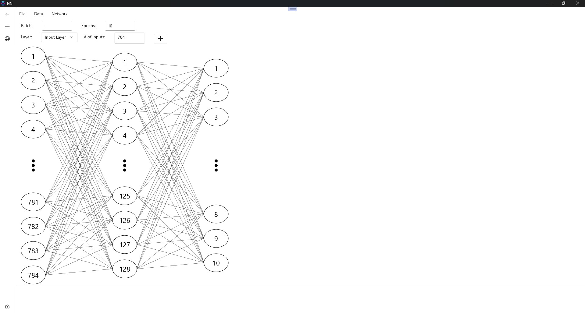

# NN tool
A Windows Raw C++ and DirectML Neural Network Trainer
Still in progress, simple MNIST training works with batch-support 

Supports:

* Training on GPU
* Training on CPU
* Testing on GPU/CPU
* Batch training
* Saving/Loading model
* Saving/Loading as PTH or ONNX with Python installed
* Customizable network structure
* Customizable activation functions

